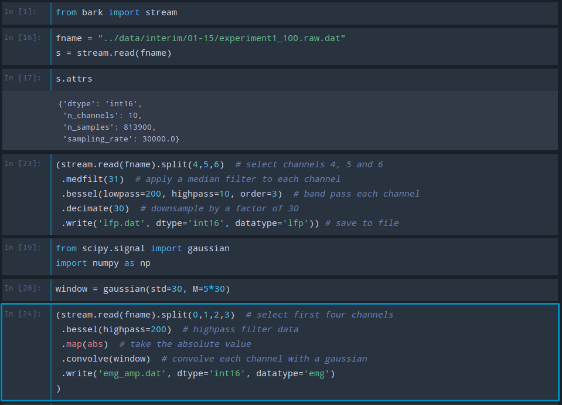

# Bark
Bark is a standard for electrophysiology data. 

[](https://travis-ci.org/kylerbrown/bark)

Version: 0.2

## The Bark philosophy
1. **minimal specification and implementation** 
2. **simple file formats** 
3. **small, chainable utilities**

By emphasizing filesystem directories, plain text files and a common binary array format, Bark makes it easy to use both
large external projects and simple command-line utilities.

Bark's [small specification](specification.md) and Python implementation are easy to use in custom tools.

These tools can be chained together using GNU Make to build data pipelines.

## Why use Bark?

Bark takes the architecture of ARF and replaces HDF5 with common data storage formats, the advantages of this approach are:

+ Use standard Unix tools to explore your data (cd, ls, grep, find, mv)
+ Build robust data processing pipelines with shell scripting or
  [make](http://kbroman.org/minimal_make/).
+ Edit metadata with a standard text editor
+ Leverage any third party tools that use Bark's common data formats.
  + Raw binary tools: [Aplot](https://github.com/melizalab/aplot), [Neuroscope](http://neurosuite.sourceforge.net/), 
[Plexon Offline Sorter](http://www.plexon.com/products/offline-sorter), [Wave_clus](https://github.com/csn-le/wave_clus), 
[spyking circus](https://spyking-circus.readthedocs.io), [phy](https://github.com/kwikteam/phy), [sox](http://sox.sourceforge.net/sox.html).
  + CSV tools: R, Pandas (Python), Excel, csvkit and Unix tools like sed and
      awk.
+ Include non-standard data such as images or video in Bark entries.

## The elements of Bark
Bark trees are made from the following elements:

- **SampledData** stored as raw binary arrays. Metadata is stored in another
  file with ".meta.yaml" appended to the dataset's filename.
- **EventData** stored in CSV files. As above, metadata is stored in a "X.meta.yaml"
  file.
- **Entries** (often trials) are directories containing Datasets that share a
  common time base. These directories contain a `meta.yaml` file and any number
  of Datasets.
- **Root** is a directory containing a collection of related Entries. Often a Root
  is used to contain all data from an experimental session.

This repository contains:

-   The specification for bark (in [specification.md](specification.md))
-   A python interface for reading and writing Bark files
-   Tools to accomplish common Bark tasks

## Installation

The python interface requires Python 3.5+. Installation with [Conda](http://conda.pydata.org/miniconda.html) is recommended.

    git clone https://github.com/kylerbrown/bark
    cd bark
    pip install -r requirements.txt
    pip install .


    # optional tests
    pytest -v


You'll also probably want to install [Neuroscope](http://neurosuite.sourceforge.net/). [Sox](http://sox.sourceforge.net/sox.html) is also useful.
# Shell Commands

Every command has help accessible with the flag `-h` (e.g. `bark-entry -h`).

## Transformations

- `bark-entry` -- create entry directories for datasets
- `bark-attribute` -- create or modify an attribute of a bark entry or dataset
- `bark-clean-orphan-metas` -- remove orphan `.meta.yaml` files without associated data files
- `dat-select` -- extract a subset of channels from a sampled dataset
- `dat-join` -- combine the channels of two or more sampled datasets
- `dat-split` -- extract a subset of samples from a sampled dataset
- `dat-cat` -- concatenate sampled datasets, adding more samples
- `dat-filter` -- apply zero-phase Butterworth or Bessel filters to a sampled dataset
- `dat-decimate` -- down-sample a sampled dataset by an integer factor, you want to low-pass filter your data first.
- `dat-diff` -- subtract one sampled dataset channel from another
- `dat-ref` -- for each channel: subtract the mean of all other channels, scaled by a coefficient such that the total power is minimized
- `dat-artifact` -- removes sections of a sampled dataset that exceed a threshold
- `dat-enrich` -- concatenates subsets of a sampled dataset based on events in an events dataset
- `dat-spike-detect` -- detects spike events in the channels of a sampled dataset
- `dat-segment` -- segments a sampled dataset based on a band of spectral power, as described in [Koumura & Okanoya](dx.doi.org/10.1371/journal.pone.0159188)

There are many external tools for processing CSV files, including [pandas](http://pandas.pydata.org/) and [csvkit](https://csvkit.readthedocs.io).
## Visualizations

- `bark-scope` -- opens a sampled data file in [neuroscope](http://neurosuite.sourceforge.net/). (Requires an installation of neuroscope)  
- `bark-label-view` -- Annotate or review events in relation to a sampled dataset, such as birdsong syllable labels on a microphone recording.

## Conversion

- `bark-convert-rhd` -- converts [Intan](http://intantech.com/) .rhd files to datasets in a Bark entry
- `bark-convert-openephys` -- converts a folder of [Open-Ephys](http://www.open-ephys.org/) .kwd files to datasets in a Bark entry
- `csv-from-waveclus` -- converts a [wave_clus](https://github.com/csn-le/wave_clus) spike time file to a CSV
- `csv-from-textgrid` -- converts a [praat](http://www.fon.hum.uva.nl/praat/) TextGrid file to a CSV
- `csv-from-lbl` -- converts an [aplot](https://github.com/melizalab/aplot) [lbl](https://github.com/kylerbrown/lbl) file to a CSV
- `csv-from-plexon-csv` -- converts a [Plexon OFS](http://www.plexon.com/products/offline-sorter) waveform CSV to a bark CSV
- `dat-to-wave-clus` -- convert a sampled dataset to a [wave_clus](https://github.com/csn-le/wave_clus)
  compatible Matlab file
- `dat-to-wav` -- convert a sampled dataset to a WAVE file.

# Python interface
```python
import bark
root = bark.read_root("black5")
root.entries.keys()
# dict_keys(['2016-01-18', '2016-01-19', '2016-01-17', '2016-01-20', '2016-01-21'])
entry = root['2016-01-18']
entry.attrs
# {'bird': 'black5',
# 'experiment': 'hvc_syrinx_screwdrive',
# 'experimenter': 'kjbrown',
# 'timestamp': '2017-02-27T11:03:21.095541-06:00',
# 'uuid': 'a53d24af-ac13-4eb3-b5f4-0600a14bb7b0'}
entry.datasets.keys()
# dict_keys(['enr_emg.dat', 'enr_mic.dat', 'enr_emg_times.csv', 'enr_hvc.dat', 'raw.label', 'enr_hvc_times.csv', 'enr.label'])
hvc = entry['enr_hvc.dat']
hvc.data.shape
# (7604129, 3)
```


The `Stream` object in the `bark.stream` module exposes a powerful data pipeline design system for sampled data.
Example usage:



# Pipelines with GNU Make
Some links to get started with Make:

+ http://kbroman.org/minimal_make/
+ https://bost.ocks.org/mike/make/
+ https://swcarpentry.github.io/make-novice/

# Related projects

-   NEO <https://github.com/NeuralEnsemble/python-neo>
-   NWB <http://www.nwb.org/>
-   NIX <https://github.com/G-Node/nix>
-   neuroshare (<http://neuroshare.org>) is a set of routines for reading and
    writing data in various proprietary and open formats.

# Authors

Dan Meliza created ARF.
Bark was was written by Kyler Brown so he could finish his damn thesis in 2017. Graham Fetterman also made
significant contributions.
